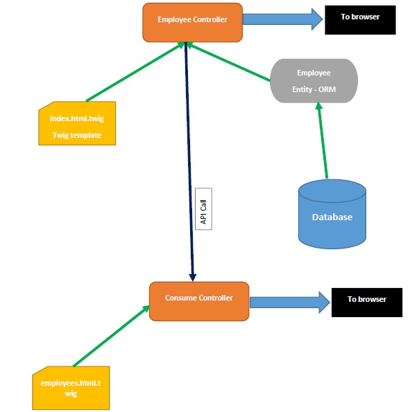

# symphony_rest_service

MVC code using Symphony framework:
- Fetch record from MySQL DB and display data throughout the Twigs
- Create a service to deliver content through REST API. Consume the same API and pass the data throughout the Twigs, to display the Records

# Built
App is built on Symfony 5.0, doctrine 3.3, twig 1.0, flax 1.6, PHP 7.5.2 & MySQL 5.7

# Architecture

